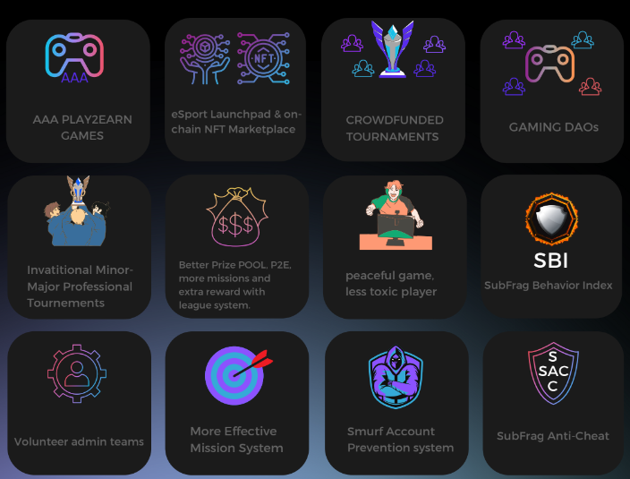

# Project Subfrag

Subfrag is the P2E Matchmaking & Tournement
platform for real players. Created by Veteran
players for competitive mode games.

## Table of Contents:

- [About Us](#about-us)
- [Problems](#problems)
- [What do we want to bring as Subfrag](#what-do-we-want-to-bring-as-subfrag)
- [The MVP of the platform](#the-mvp-of-the-platform)

## About Us

As the initiators of this groundbreaking project, we are a team of seasoned veterans and semi-professional players with a deep-rooted passion for the world of competitive Counter-Strike:

Global Offensive. Each of us hails from a diverse background, with unique skills and experiences
that have been refined over countless tournaments and battles. Together, we form a formidable
force in the eSports arena, combining our expertise and dedication to create something truly
extraordinary.

United by our love for the game and driven by our shared ambition, we have embarked on this
exciting journey to make our mark on the CS:GO competitive scene. Our camaraderie, built upon
mutual respect and admiration, transcends the digital realm, fostering an environment where
creativity and innovation flourish.

Our unwavering commitment to this project is fueled by the belief that collaboration, hard work,
and passion can lead to unparalleled success. As we continue to refine our strategies and
tactics, we draw upon our collective experiences to overcome challenges and seize
opportunities that come our way. Our resilience and tenacity in the face of adversity have
become an inspiration to aspiring players who look up to us as role models and trailblazers in
the eSports community.

As initiators, we have taken it upon ourselves to pave the way for the future of competitive
CS:GO, ensuring that our legacy will continue to inspire and motivate the next generation of
gamers. Our journey, a testament to the power of teamwork and dedication, has only just begun.
With every step we take, we remain steadfast in our pursuit of excellence, driven by our passion
for the game that has brought us together and forever changed our lives.

## Problems
Herein, we aim to articulate the two primary challenges or focus areas prevalent in competitive gaming platforms:

### Problem ONE

Upon analyzing the current Play2Earn gaming landscape, 
we've identified two key issues that we are determined to address. 
The first issue is the limited reach of these games, which predominantly attract a small group 
of players primarily involved in a specific blockchain ecosystem. This restriction hinders the growth and wider acceptance of Play2Earn games in the mainstream gaming community.

The second problem lies in the quality of the gaming experience. Many Play2Earn games grapple with scalability issues and high latency, which diminish the gameplay experience. Scalability problems, which prevent these games from efficiently handling an increase in players or transactions, often result in slow, laggy gameplay. High latency or 'ping' issues contribute to delays between a player's action and the game server's response, disrupting the real-time interaction crucial for an immersive gaming experience.

Our mission is to tackle these challenges head-on, creating a Play2Earn platform that is accessible to a broader audience, and delivers a high-quality, smooth, and responsive gaming experience.

### Problem TWO

In the realm of competitive gaming, countless players around the world harbor aspirations of turning their passion into a professional career. They pour in countless hours, honing their skills and building their teams, all with the dream of reaching the professional echelons.

However, one of the main barriers is the lack of adequate platforms where they can effectively test their abilities and showcase their talent. Opportunities for proving their mettle in a competitive setting, particularly for team-based competition, are scarce.

Additionally, there's a significant gap when it comes to rewards. Despite their dedication and the time they invest, many players find that there's little to no return on their efforts. They're seeking to improve, to compete, and ultimately to earn from their gaming skills, but the current gaming landscape often fails to provide a path for monetary gain or career progression.

Our goal is to address these issues by creating a platform that not only provides the much-needed competitive arena for teams, but also recognizes and rewards players' time and skill investment, providing a real opportunity for players to turn their passion for gaming into a viable career.

## What do we want to bring as Subfrag

Our primary objective is to help you elevate, enhance, and sustain your gaming career. But paramount to all, we strive to ensure that you derive immense enjoyment while playing on our platforms.

We firmly believe that gaming isn't just about competition or career progression; it's about the thrill, the joy, the sheer fun of immersing oneself in different worlds and narratives. We aim to make that experience as enjoyable and rewarding as possible for you.

To realize this, we've diligently crafted a range of values that serve as the cornerstone of our platform. These values not only define who we are but also what we offer to you as a player. They are not just words, but commitments that we're determined to fulfill for you on our platform.

We invite you to partake in this exciting journey, as we build together a platform that cherishes your love for gaming and supports your career aspirations. Please stay tuned as we unveil more details about our platform and the unique values that make us stand apart.

We are committed to maintaining a friendly and respectful environment, and any form of misconduct will be met with stringent measures on our platforms. Our robust moderation systems, equipped with advanced AI technology, ensure a safe and positive space for all players.

Furthermore, we are continually improving our reporting mechanisms, making it easier for you to flag inappropriate behavior. Our aim is to foster a community that encourages camaraderie, fair play, and the spirit of healthy competition, making your gaming experience not just fun, but also secure and respectful.

## The MVP of the platform

Our platform is designed to be a cutting-edge gaming hub, with our initial Minimum Viable Product (MVP) focusing on serving the Counter-Strike: Global Offensive (CS:GO) community. We've adopted a modular, scalable architecture to ensure our platform can easily evolve and expand to support more games in the future.

The platform's core is a robust server infrastructure, specifically optimized for hosting CS:GO servers. Our servers are designed to deliver low latency and high-performance gameplay, providing an unparalleled CS:GO experience. This ensures that every bullet, every strategy, and every move in your game is as responsive and reliable as possible.

Furthermore, our platform incorporates state-of-the-art matchmaking systems. These algorithms are designed to pair you with players of similar skill level, ensuring balanced and competitive matches.

Our user interface is clean, intuitive, and easy to navigate, which makes the process of finding games, interacting with other players, and accessing platform features smooth and effortless.

On the security front, our platform has been engineered with a strong focus on fairness and player safety. Sophisticated anti-cheat systems work tirelessly to ensure a level playing field, while rigorous community management tools keep toxicity in check.

Finally, we've built in robust analytics capabilities. This means that over time, we'll be able to use data to improve the platform and introduce new features that our users really want.

This MVP is just the beginning. As we grow and learn from our users' feedback, we will continue to refine and expand our platform, with the ultimate aim of providing the best possible gaming experience.

We are profoundly grateful for your interest and the time you've taken to understand our project. Your curiosity and support are the driving forces that enable us to continue our work, and we sincerely thank you for that.

We hope our project resonates with you and that you share our vision of transforming the gaming landscape. We invite you to join us on this exciting journey. Your support, be it through sharing our mission with others, providing feedback, or simply staying updated with our progress, is invaluable to us.

Please stay tuned for more updates and developments. We have many exciting plans in the pipeline, and we can't wait to share them with you. Together, we can redefine the future of competitive gaming. Thank you once again for your support and interest.
